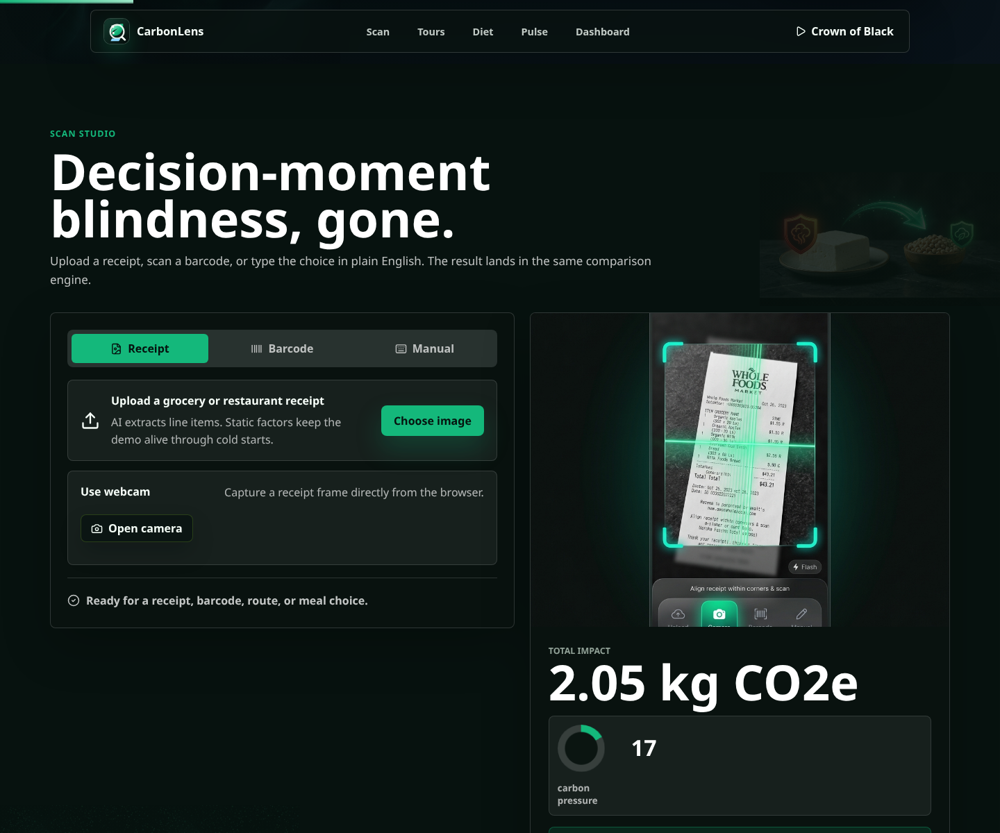
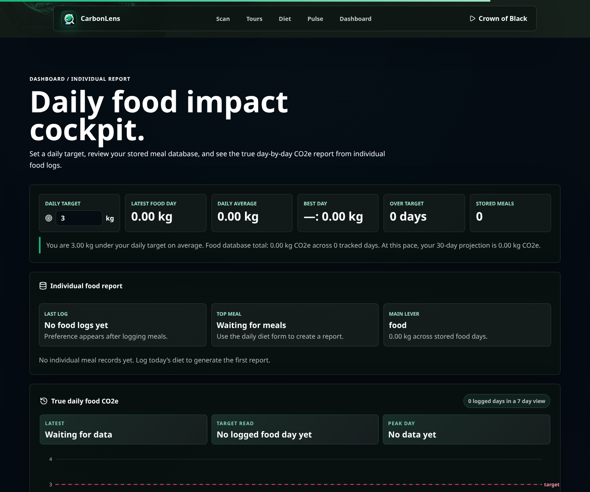
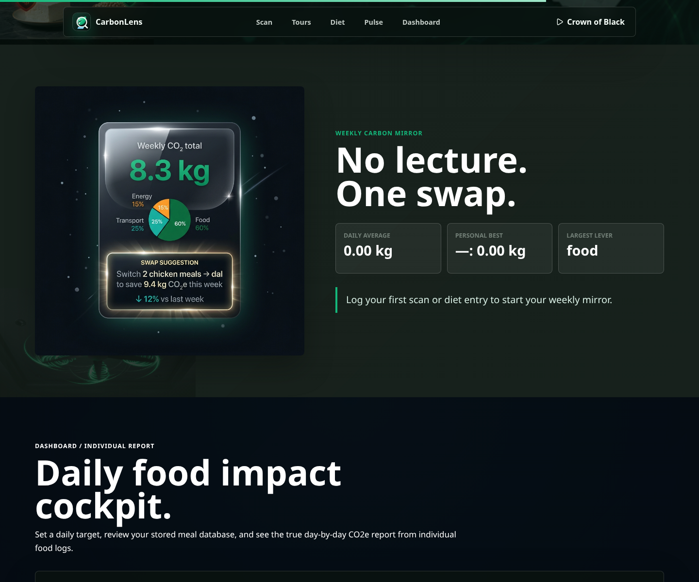

# CarbonLens

CarbonLens is an immersive, local-first carbon tracker for everyday choices. It turns receipts, barcodes, route plans, and meal logs into CO2e estimates, human-scale comparisons, and a dashboard that shows how previous entries are trending over time.

The product goal is simple: remove carbon decision-blindness at the moment someone is choosing what to buy, eat, or book.

## Screenshots


The landing screen sets the tone immediately: a cinematic hero, clear scanner entry points, and the decision framing that makes CarbonLens feel like a product rather than a form.



The scanner view handles receipt uploads, webcam capture, barcode lookup, and natural-language entry in one flow, so users can start from whatever data they already have.


The route planner combines map data, transport mode, trip length, and travel context into a practical carbon estimate that is easier to act on than a raw number.



The dashboard turns prior entries into a readable performance view with totals, category splits, moving averages, and target gaps without exposing personal inputs.



The weekly mirror turns stored history into one concrete swap for the next week, which keeps the feedback specific and usable.


The toxic Rive scene is part of the animated asset set, showing how motion and playful visual feedback are used throughout the site.

## What It Does

- Scans receipt images and webcam captures, then estimates purchasable line-item impact.
- Looks up barcodes through Open Food Facts and converts products into a comparable CO2e result.
- Accepts plain-language manual input such as `2 samosas, 1 Uber 8km, 500g paneer`.
- Plans routes with Leaflet, OpenStreetMap, OSRM, and Nominatim, including transport mode, congestion strategy, travel food, budget, and traveler count.
- Logs daily meals into a local food database and builds a true day-by-day report from previous entries.
- Shows category breakdowns, moving averages, target gaps, best days, and 30-day projections.
- Tracks anonymous usage pulse metrics such as unique browser count, visits, saved actions, and active days.
- Pulls sustainability context from the backend article endpoint, with local fallbacks for Space deployments.
- Uses local videos, images, soundtrack, and Rive scenes for the cinematic experience.

## Why We Built It

Carbon footprint tools often fail at the exact moment they need to help: when someone is choosing a meal, scanning a product, booking a trip, or reviewing a daily habit. CarbonLens was built to make that invisible impact immediate, visual, and practical. Instead of asking users to study abstract kilograms, it converts everyday inputs into CO2e, compares them with familiar anchors, and suggests one next swap.

The challenge problem asks for awareness through simple actions and personalized insights. CarbonLens maps directly to that:

- **Understand:** every result includes item-level CO2e, category split, and a human-scale comparison.
- **Track:** meal logs and anonymous previous-entry pulse metrics show trends over days.
- **Reduce:** the app highlights the largest lever and gives one lower-carbon move instead of a long guilt list.
- **Personalize:** estimates respond to the user's receipt, barcode, route, diet, budget, travelers, and local city context.

## Tech Stack

- **Frontend:** React 19, Vite, Framer Motion, Recharts, Lucide icons, Rive canvas animations.
- **Carbon engine:** local emission-factor tables, quantity parsing, default portion logic, and comparison anchors in `src/data/carbon.js`.
- **Routing:** Leaflet, OpenStreetMap tiles, OSRM route distance, Nominatim geocoding, with deterministic fallback distance math.
- **Product data:** Open Food Facts barcode lookup with sanitized numeric barcodes.
- **Backend:** FastAPI for health, food images, articles, and privacy-safe aggregate usage analytics.
- **Space runtime:** Docker plus `server.mjs`, serving the built app on port `7860` with API fallbacks.
- **Testing:** Node test runner for frontend/domain logic and Python `unittest` for backend analytics.

## Evaluation Readiness

- **Code quality:** core carbon, route, input-safety, and usage logic are split into small tested modules with clear data boundaries.
- **Security:** no AI/provider secrets are required in the frontend build; receipt uploads are type/size checked; barcodes are numeric-only; usage totals are clamped; server responses include CSP, frame denial, no-sniff, HSTS, referrer, permissions, and opener-policy headers.
- **Efficiency:** route calculations reuse pure helpers, scraper responses are cached, static Space assets receive long-lived cache headers, and non-critical images use lazy loading/async decoding.
- **Testing:** `npm run check` runs ESLint, all Node tests, all Python usage tests, and the production build.
- **Accessibility:** zoom is not blocked, a skip link is present, form fields have labels, interactive mode controls expose selected state, decorative media is hidden from assistive tech, charts/maps are labelled regions, and live status updates use `aria-live`.

## Privacy Model

CarbonLens is intentionally privacy-light.

- Meal logs, scan history, dashboard targets, and anonymous browser metrics are stored in the browser through `localStorage`.
- The optional `/api/usage-event` endpoint only receives a random browser ID, event type, date, and CO2e total.
- The backend hashes random browser IDs before storing aggregate unique-user counts.
- Usage analytics never store names, typed meal text, receipt text, barcode values, route locations, camera images, or IP-derived profile data.
- The submitted frontend build does not require model-provider secrets. If provider integrations are added later, they should run through a private backend proxy.

## Run Locally

Install frontend dependencies:

```bash
npm install
```

Start the Vite app:

```bash
npm run dev
```

Start the optional FastAPI backend:

```bash
python3 -m venv backend/venv
backend/venv/bin/pip install -r backend/requirements.txt
npm run backend
```

The frontend reads `VITE_BACKEND_URL=http://127.0.0.1:8001` when you want backend-powered image search, article scraping, and aggregate anonymous usage stats.

## Environment

Create `.env.local` for local secrets. It is ignored by Git.

```bash
VITE_BACKEND_URL=http://127.0.0.1:8001
CARBONLENS_ALLOWED_ORIGINS=http://127.0.0.1:5173,http://localhost:5173
CARBONLENS_USAGE_FILE=/tmp/carbonlens_usage.json
```

Do not expose provider secrets with `VITE_*` variables. Frontend builds can reveal those values in browser JavaScript, so production provider calls should go through a backend route.

Maps are free/open by default:

- Leaflet renders the browser map.
- OpenStreetMap provides basemap tiles.
- OSRM provides route distance where available.
- Nominatim resolves place names for demo-scale geocoding.

Nominatim has a public usage policy and should be used gently. For production, run your own Nominatim instance or use a hosted OSM-compatible geocoder.

## Backend Endpoints

```text
GET  /api/health
GET  /api/food-image?query=paneer
GET  /api/articles
POST /api/usage-event
```

`POST /api/usage-event` accepts only anonymous aggregate analytics:

```json
{
  "anonymous_id": "random-browser-id",
  "event_type": "visit",
  "total_kg": 0
}
```

Allowed event types are `visit`, `scans`, `routes`, and `diets`.

## Hugging Face Space

This repo is ready for a Docker-based Hugging Face Space. The included `Dockerfile` builds the Vite app and serves it on port `7860`.

```bash
npm run build
npm run space
```

The Space server includes browser-side fallbacks for food images and articles, plus an in-memory version of anonymous usage aggregation.

## Project Structure

```text
src/App.jsx                 Main immersive React experience
src/styles.css              Responsive app styling
src/data/carbon.js          Carbon factors and comparison anchors
src/services/aiClients.js   Local-safe parsing, receipt validation, barcode lookup, and comparison phrasing
src/services/inputSafety.js Upload validation helpers
src/services/routeMath.js   Pure route parsing, distance, and impact helpers
src/services/backendApi.js  Backend, image, article, and usage API helpers
src/services/maps.js        Leaflet/OpenStreetMap/OSRM route logic
backend/usage.py            Privacy-safe aggregate analytics logic
backend/main.py             Optional FastAPI API
server.mjs                  Static Space server with API fallbacks
public/assets/              Local videos, images, Rive files, and audio
```

## Build Check

```bash
npm test
npm run test:python
npm run build
npm run check
```

`npm run check` runs linting, the Node test suite, the Python usage tests, and the production build in sequence.
